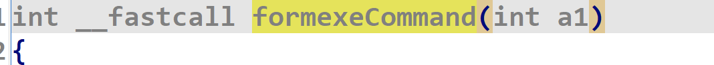
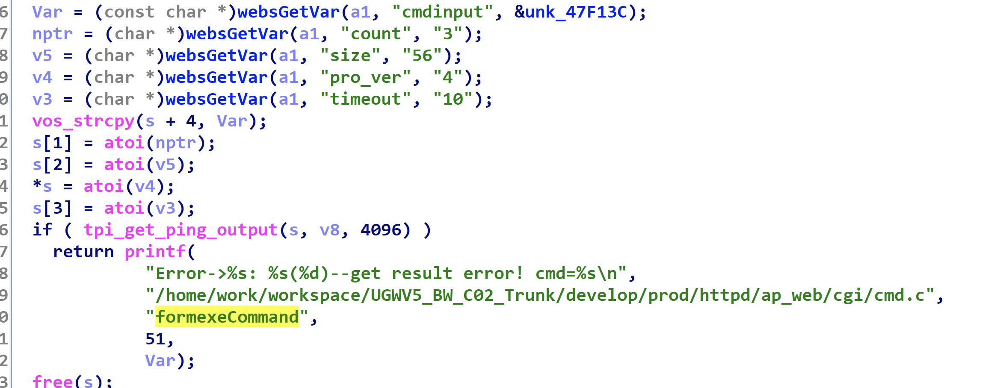
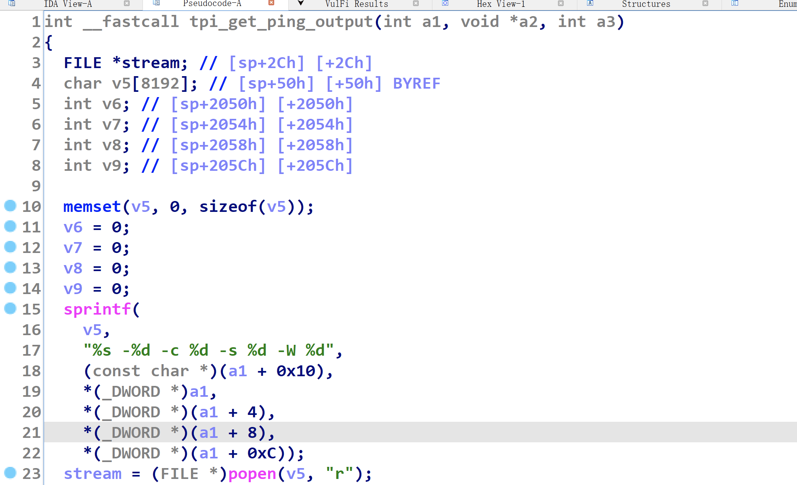

# Tenda W6 Command Injection Vulnerability

## Device Vulnerability Introduction
Tenda W6 is an enterprise wireless AP router from Tenda Technology (Shenzhen, China).

A command injection vulnerability exists in /goform/exeCommand in Tenda W6 V1.0.0.9(4122) version, which allows attackers to construct cmdinput parameters for arbitrary command execution

Firmware download at: https://www.tenda.com.cn/download/detail-2576.html

## Exploit process

